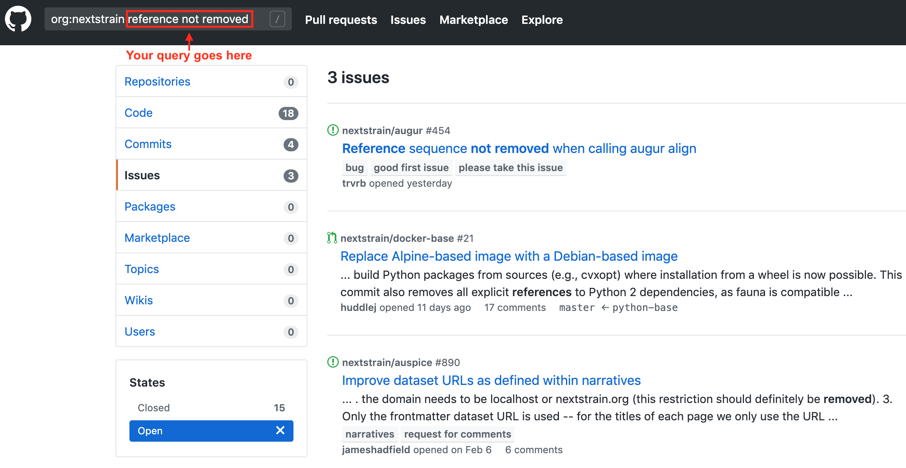

# Contributing to Nextstrain

Nextstrain is an open-source and open-science project and we welcome community contributions. This includes contributions of bug reports, feature requests, data submission, scientific interpretation, language translations, and, of course, software development work across our repositories.

We particularly encourage contributors from underrepresented backgrounds to engage and join our community. Please note that all Nextstrain projects follow and enforce the [Contributor Covenant Code of Conduct](https://www.contributor-covenant.org/).

## Contributing code

Nextstrain comprises [multiple interconnected software components](https://github.com/nextstrain/). Below is a list of Nextstrain’s primary components with links to their active issues.

- [nextstrain.org](https://github.com/nextstrain/nextstrain.org/issues): static content and documentation for the nextstrain.org website
- [auspice](https://github.com/nextstrain/auspice/issues): front-end visualization application 
- [augur](https://github.com/nextstrain/augur/issues): back-end bioinformatics tools 
- [cli](https://github.com/nextstrain/cli/issues): unified command-line interface for analyzing and visualizing data 
- [ncov](https://github.com/nextstrain/ncov/issues): hCoV-19 data analysis pipeline 

### Quick start

1. Find an open issue that matches your skills and interests [on a Nextstrain project board](https://github.com/orgs/nextstrain/projects) or [among all issues for Nextstrain components listed above](https://github.com/search?q=org%3Anextstrain&state=open&type=Issues).

2. **Comment on the issue**, to let us know you’d like us to assign that issue to you. Include a brief description of how you plan to address the issue and, optionally, any prototypes or mockups of your planned implementation. We will respond to your comment to let you know you’ve been assigned or to clarify aspects of your proposed solution.

3. **Submit your solution** to the selected issue as a pull request (PR). We will review your contribution, offer constructive feedback, and merge your solution with the repository when all outstanding review comments have been resolved.

_If you're new to Github, check out [this awesome list of resources](https://github.com/freeCodeCamp/how-to-contribute-to-open-source#using-version-control) to help get you started!_

### Development details

Please see `DEV_DOCS.md` in the relevant repository for guidance on how to set up your dev environment, etc. 

We use Python for back-end components and loosely follow [the PEP 8 standard](https://www.python.org/dev/peps/pep-0008/). We use Javascript for front-end components and use [eslint](https://eslint.org/) to enforce [a custom set of linting rules](https://github.com/nextstrain/auspice/blob/master/.eslintrc).

## Improve Nextstrain's software without code

### Report a bug

If you think you’ve found a bug in a component of Nextstrain, [first search for an existing bug report across all issues in the organization](https://github.com/search?q=org%3Anextstrain&state=open&type=Issues).

If you find an existing bug report, add a description of your experience to that issue.

If you don’t find an existing bug report, create a new issue in the appropriate repository (see list of Nextstrain components above) and select "Bug report."

### Request a feature

If you’ve thought of a way to improve Nextstrain, first [search our existing issues](https://github.com/search?q=org%3Anextstrain&state=open&type=Issues) to see if someone else already requested the same thing.

If you don't find an existing feature, create a new issue in the appropriate repository (see list of Nextstrain components above) and select "Feature request."

### Contribute documentation

Did you find a typo or a mistake in our existing documentation? Did you work through an example in a tutorial only to find it was missing a step? Are you trying to accomplish specific something with Nextstrain but can't find any description of that analysis? Did you find [an open issue on our project boards](https://github.com/orgs/nextstrain/projects) for improving documentation and you want to help out?

These are all great opportunities for you to help improve our documentation. Find the Nextstrain component you'd like to contribute and review the contributing guide for that component's documentation using the links below.

  - [nextstrain.org](https://nextstrain.org/docs/contributing/documentation)
  - [auspice](https://github.com/nextstrain/auspice/tree/master/docs-src)
  - [augur](https://github.com/nextstrain/augur/#documentation)

## Contribute science & communications

Nextstrain is more than the software used to build and visualize data on nextstrain.org. We rely on contributions from other scientists including data, scientific interpretation of results, and language translations of situation reports, user interfaces, and documentation. 

### Submitting data

Please refer to the [pathogen-specific repository](https://github.com/nextstrain) for information about where data is being sourced from. For example, the SARS-CoV-2 data is being pulled from GISAID; we'll pick up any new sequence data submitted there and include it in our next public build. 

Alternatively, you may be interested in making your own [community build](https://nextstrain.org/docs/contributing/community-builds) for your specific dataset.

### Sharing interpretations

Nextstrain Narratives allow scientists to easily share text linked to corresponding Nextstrain visuals. For example, we use these for our COVID-19 Situation Reports. You can [learn more about Narratives here](https://nextstrain.org/docs/narratives/introduction).

### Foreign language translations

Please see [this project board]() for more information about how to help with foreign language translations.
